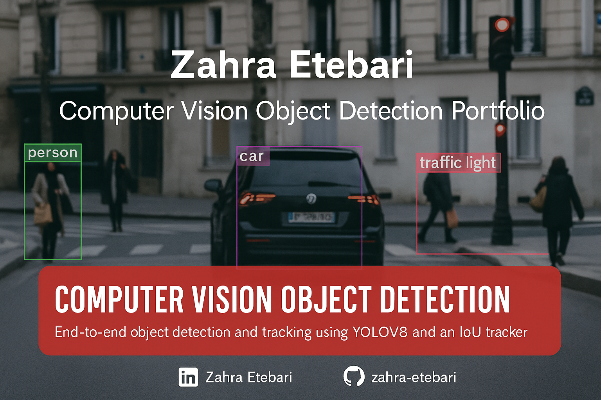

#  Computer Vision – Object Detection

###  End-to-End Object Detection and Tracking using YOLOv8 and IoU Tracker

This project demonstrates an **end-to-end pipeline** for real-time object detection and tracking using **YOLOv8** and a simple **IoU-based tracker**.  
It detects, classifies, and tracks multiple objects across video frames, evaluates model performance, and visualizes the results.

---

##  Project Overview
- **Frameworks:** PyTorch, OpenCV, YOLOv8  
- **Goal:** Detect and track multiple object classes in a video  
- **Dataset:** MS COCO (pre-trained YOLOv8)  
- **Output:** Detection overlays, tracking IDs, and evaluation plots  

---

##  Steps
1. **Data Collection:** Load and extract frames from `.mp4` videos.  
2. **Detection & Tracking:** Run YOLOv8 for detection; use IoU tracker for ID continuity.  
3. **Ground Truth Creation:** Generate manual annotations for evaluation.  
4. **Evaluation:** Calculate Precision, Recall, F1, AP, and mAP.  
5. **Visualization:** Create plots for class counts and per-class Precision–Recall.

---

##  Example Visuals
- Object detection with bounding boxes and labels.  
- Tracking with unique IDs per object.  
- Bar charts and metrics from evaluation scripts.

---

##  Repository Structure

# Computer-vision-Object-detection
End-to-end object detection and tracking using YOLOv8 and an IoU tracker. Detects, classifies, and tracks multiple objects in video frames, evaluates performance with Precision, Recall, F1, AP, and mAP, and visualizes results through detection overlays and performance plots.

├── images/ # Visualizations and banner
├── model/ # Trained YOLOv8 weights (.pt)
├── videos/ # Input and processed video files
├── LICENSE
├── README.md
└── .gitignore

---

##  Results Summary
✅ Average Precision (mAP): *xx.x%*  
✅ Precision–Recall curves and per-class metrics included.  
✅ Lightweight IoU tracker ensures efficient tracking.

---

##  Author
**Zahra Etebari**  
📍 AI & Data Science Engineer | Computer Vision Enthusiast  
🔗 [LinkedIn](https://www.linkedin.com/in/zahra-etebari) | [GitHub](https://github.com/Zahra58)

---

##  License
This project is licensed under the [MIT License](LICENSE).

